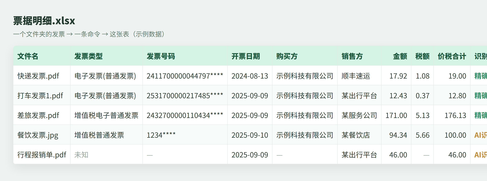

# fapiao2excel · 票据批量转 Excel

把**一整个文件夹**的发票 / 票据，一条命令识别成一张**结构化 Excel 表**。

核心是**分层识别**：电子发票 PDF 直接精确解析（0 token、金额自校验、不用 key），只有图片/扫描件才用视觉大模型兜底。用大模型那层**填你自己的 key（BYOK）**，模型无关，工具本身不收集任何数据。

---

## 缘起（作者的话）

我是个 35+ 的前端。做这个，是因为自己每个月都要把一堆发票挨张抄进 Excel，抄到怀疑人生。

与其焦虑 AI 会不会替掉我，不如把每天烦我的破事一件件搓成工具——**做出来自己就能用，扔出去居然还有人要**，这种踏实比什么都稳。

不打算靠它赚钱，也不卖课。开源免费，拿去改。跑代码卡在哪一步，欢迎提 issue，我一条条答。

## 为什么做这个（和直接丢千问 App 有啥区别）

单张识别，千问 / 豆包 App 早就免费能做了。这个工具解决的是 App **不做**的那一层：

| | 千问 App | fapiao2excel |
|---|---|---|
| 处理量 | 一次一张，手动传 | 一条命令跑**整个文件夹** |
| 结果 | 一段文字，还得自己整理 | 直接落地成**固定字段的 Excel** |
| 字段 | 随模型发挥 | 对准增值税发票**定死字段**、可改 |
| 金额准确性 | AI 直接读，可能幻觉 | **电子发票 0 token 精确解析 + 金额自校验** |

适合：一堆票据要归档、报销、记账的场景（代账、小微、个人报销）。

## 怎么避开「AI 幻觉」（核心设计）

大家最担心的就是 AI 把金额、税号读错。这工具用**分层 + 自校验**来兜底：

1. **能精确就绝不用 AI**：电子发票 PDF 自带文字层，直接正则解析（发票号码、日期、金额），**0 token、0 幻觉**。
2. **金额自校验**：只有当 `金额 + 税额 = 价税合计` 对得上，才采信精确解析的金额；对不上就退回 AI。
3. **AI 只兜底**：扫描件 / 图片 / 没文字层的票才用视觉模型，且输出里单列一个「识别方式」标明哪些行是精确解析、哪些是 AI，重要字段一眼知道该复核哪些。

> 实测一批真实报销票据：多数标准电子发票走**精确解析（0 token，金额校验全通过）**；只有行程单、免税单等少数走 AI 兜底。

## 效果



**输入**：`samples/` 里一堆发票（图片或 PDF 都行）
**输出**：一张 `票据明细.xlsx`（上图为示例数据，「识别方式」列标明每行来源）

## 快速开始

> 🔰 完全没装过 Python？看这篇手把手教程：[零基础安装教程（Windows）](docs/安装教程.md)

```bash
# 1. 装依赖
pip install -r requirements.txt

# 2. 配置：复制 .env.example 为 .env，填 API_KEY / BASE_URL / VL_MODEL
#    （见下方「用哪个模型」）

# 3. 把票据图片放进一个文件夹（如 samples/），然后跑：
python src/extract.py samples -o out/票据明细.xlsx
```

支持格式：图片 `.jpg .jpeg .png .webp .bmp` + **PDF `.pdf`**（电子发票绝大多数是 PDF，直接丢进去即可；多页 PDF 会按页拆成多行）。

> PDF 会先在本地渲染成图再识别，无需额外安装 poppler 等外部程序（用 PyMuPDF）。
> 暂不支持 OFD（部分税务平台的电子发票格式），如遇到可先转成 PDF。

## 跑不起来？环境排查清单（新手必看）

装了 Python 却报错、跑不动，八成是下面几种，对号入座：

| 报错 / 现象 | 原因 | 怎么解决 |
|---|---|---|
| `'python' 不是内部或外部命令` / 敲 python 没反应 | 装 Python 时没勾 PATH | 重装 Python，安装第一屏勾上 **Add python.exe to PATH**；或用 `py` 代替 `python` 试 |
| `ModuleNotFoundError: No module named xxx` | 依赖没装 | 在**项目文件夹里**跑 `pip install -r requirements.txt`；pip 不识别就用 `python -m pip install -r requirements.txt` |
| `pip` 装依赖超时 / 失败 | 默认源慢 | 换国内源：`pip install -r requirements.txt -i https://pypi.tuna.tsinghua.edu.cn/simple` |
| 提示缺 `API_KEY` / 401 / 认证失败 | `.env` 没配或 key 没填对 | 复制 `.env.example` 为 `.env`，填好 `API_KEY / BASE_URL / VL_MODEL`（见下方「用哪个模型」）|
| 电脑里装了好几个 Python，装了依赖还报缺包 | 多版本 / 环境串了 | 建议开个干净虚拟环境：`python -m venv venv` → 激活（Win：`venv\Scripts\activate`）→ 再 `pip install -r requirements.txt` |

> 排查顺序：① `python --version` 能出版本 → ② `pip install -r requirements.txt` 不报错 → ③ `.env` 填好 → ④ 跑 `python src/extract.py samples -o out/票据明细.xlsx`。
> 还是卡住，把**完整报错**贴 issue，别只说“跑不了”，报错原文最能定位问题。

## 用哪个模型（模型无关）

工具走 OpenAI 兼容接口，**任何“能读图”的多模态模型都行**，改 `.env` 三行即可：

| 模型 | BASE_URL | VL_MODEL | 拿 key |
|---|---|---|---|
| 通义千问(百炼) | `https://dashscope.aliyuncs.com/compatible-mode/v1` | `qwen-vl-max` | 阿里云百炼控制台 → API-KEY，新用户有免费额度 |
| 智谱 GLM-4V | `https://open.bigmodel.cn/api/paas/v4` | `glm-4v` | 智谱开放平台，注册有免费额度 |
| 其他 | 你的 OpenAI 兼容地址 | 对应视觉模型名 | — |

> 没有千问 key 不要紧：注册阿里云百炼或智谱，几分钟拿到带免费额度的 key 即可；
> 也可以指向你已有的任意 OpenAI 兼容视觉接口。

## 输出字段

发票类型 / 发票代码 / 发票号码 / 开票日期 / 购买方名称 / 销售方名称 /
金额(不含税) / 税额 / 价税合计 / 备注

想加减字段，改 `src/extract.py` 顶部的 `FIELDS` 列表即可（表头和提取会一起跟着变）。

## 同一套思路还能干啥（Roadmap）

这个工具本质是**「一堆文件 → 一条命令 → 一张结构化 Excel」**的第一个落点。凡是有规律、要重复干很多遍的表格活，都能套同一套思路。已经在做 / 计划做的：

- 📄 **更多单据批量抠数据**：对账单、订单、回单等自带文字层的 PDF，一次全进一张表
- 🌍 **海外发票 / 多语言**：如土耳其 e-Fatura 等，字段模板可配 + 抠完自动翻译成中文（已有用户在等）
- 📊 **多表合并**：十几张同格式月报 → 一张年表，按规则自动拼、不漏行
- 🔎 **从长文本提信息**：手机号 / 金额 / 单号，一段文字一遍挑出来成表
- ✅ **数据自检**：重复项、合计对不对，程序自己核，比人眼稳

> 想要哪个、或你有自己天天烦的重复活，欢迎提 issue —— 呼声高的先做。

## 局限 & 隐私（先说清楚）

- **识别走云端**：图片会以 base64 传给通义千问识别，介意隐私的票据请谨慎；后续可换本地多模态模型。
- **准确率取决于模型和图片质量**：模糊、遮挡、手写会掉准，重要数据请人工复核（尤其金额、税号）。
- **不是要干翻财务软件**：市面已有成熟发票识别 SaaS。这个工具主打**电子发票 0 token + 自备 key(BYOK) + 字段可定制 + 代码开源可改**，适合想自己掌控流程的人。
- 单张识别耗时取决于模型 RPM，量大时会排队。

## 技术栈

Python · 通义千问 VL（OpenAI 兼容接口）· openpyxl · python-dotenv

## License

MIT
